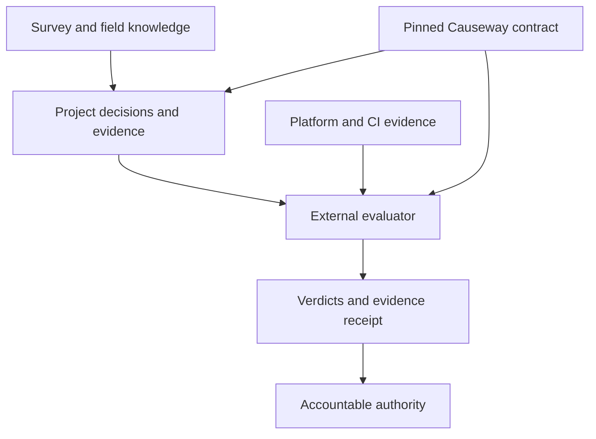

# Causeway Standard

**A versioned engineering-governance contract for deciding what to build, recording why, and specifying the evidence required to deliver it.**

Causeway helps a team answer four practical questions: What must we decide? Do we know enough to decide it? What evidence must a release carry? Who remains accountable for the result?

It combines structured intake, architectural decision records, engineering rules, machine-readable gate definitions, and platform-specific guidance. A project can pin those requirements to an exact version and an external evaluator can assess the project against that contract.

## So what? AI can write code. Causeway helps you build software someone else can trust.

AI has made producing code dramatically easier. It has not made the hard parts of software engineering disappear.

A coding agent can build a working application without asking who owns the data, what happens when a dependency fails, how secrets are handled, which decisions are expensive to reverse, whether the system can be rebuilt offline, what evidence a reviewer will need, or who accepted the remaining risk. The application may work and still be impossible to explain, operate, secure, accredit, or safely change.

Traditional development organizations address those problems through experienced engineers, architecture reviews, coding standards, test practices, security gates, release management, and institutional memory. An AI-assisted builder—especially one who is not a career developer—may have none of that machinery around them.

Causeway Standard puts the parts of a mature software-development organization that are easy to lose—especially during AI-assisted development—directly into the project. The goal is to programmatically provide the surrounding discipline that makes software explainable, supportable, secure, reviewable, and safe to change: deciding what must be settled before development begins; recording why important choices were made; preserving operational and domain constraints between conversations; requiring evidence for tests, dependencies, security, and release readiness; and making exceptions, waivers, and accountable owners visible.

Causeway packages that discipline as a set of reusable files, methods, templates, and machine-readable contracts that travel with the code. Its major pieces work together:

- The **Survey** surfaces missing constraints, assumptions, dependencies, and unanswered questions before they become convenient defaults in the implementation.
- The **Decision Spine** identifies the architectural and engineering decisions a project may need to close, scaled to the system’s role and the consequences of failure.
- **Build DNA** gives human contributors and coding agents persistent project rules for how work should be designed, tested, documented, and changed.
- **ADRs, field notes, and exception records** preserve why the system works as it does, including knowledge contributed by operators and subject-matter experts who do not write software.
- The **gate contract** defines which evidence an external evaluator should inspect and which failures should warn or block, with rigor derived from the system’s tier and criticality rather than selected by the development team.

The potential value is not that Causeway makes every design decision correct or turns a non-developer into a senior engineer\. It is that it makes the important questions difficult to skip and the resulting answers inspectable by someone other than the person—or model—that wrote the code\. That can reduce rediscovery, architectural churn, undocumented exceptions, and the “it works, but nobody can explain or approve it” problem. It also creates continuity across developers, AI agents, reviewers, and future maintainers: the project’s engineering memory lives with the project instead of inside a chat history or one person’s head\.

Causeway is not an application framework, an AI coding agent, an accrediting authority, or a guarantee of production readiness\. It supplies the standard and the evidence contract; a project still needs people with authority to make decisions, an evaluator to execute the applicable checks, and organizational controls to enforce the results.

---

For an AI-assisted builder, that changes the workflow:

1. You describe the system and the environment in which it must survive.
2. Causeway helps surface the questions that should be answered before the agent invents convenient defaults.
3. Decisions that are ready become recorded architecture decisions. Decisions that are not ready become visible probes, blockers, or open items.
4. The coding agent works under persistent repository rules instead of relying on instructions buried in an old chat.
5. Changes remain small enough to review and revert, and changed behavior is expected to arrive with tests.
6. The required level of rigor comes from the system’s role and consequences—not from how confident its builder feels.
7. An evaluator can inspect the resulting evidence without pretending that an unperformed check passed.

Causeway does not turn a non-developer into a senior engineer. It does not guarantee that a decision is good, execute the evaluator, approve a release, accept risk, or certify a system.

It does something more practical: it gives AI-assisted work the same kinds of questions, records, controls, and evidence that serious traditional development expects—and makes the missing pieces visible while they can still be fixed.

In plain English: **Causeway lets you use AI to move faster without making “the AI built it” your entire engineering methodology.**

## Current version

Source now ships **2.3.1** (`RELEASED` 2026-10-08). Build DNA 1.13; gate configuration 0.8; ServiceNow overlay 1.12. The first public release was 2.2.0.

The table below is a dated review snapshot, not a claim about the current commit: it records what was verified on **2026-09-18** against commit `93fbdd1`, at 1.15.0. That commit is in the standard's pre-publication history, which this repository does not carry ([ADR 0039](decisions/0039-publish-from-a-fresh-history.md)). What has moved since is in [CHANGELOG.md](CHANGELOG.md); 1.16.0 has not been through the same external review.

| Artifact | Verified state |
|---|---|
| Source and published release | **1.15.0**; `v1.15.0` pointed to the reviewed commit |
| Build DNA | 1.12 |
| Decision Spine | 0.8: 94 engineering decision rows |
| Gate configuration | 0.6: 27 check definitions, 14 input classes, four profiles, eight verdicts |
| ServiceNow overlay | 1.9, ratified against the versions above |
| Release assets | Tar and ZIP archives, their SHA-256 sidecars, a release statement, and its detached SSH signature |
| Verification | The standard and release workflows succeeded at that commit |

The current 29-file consumer bundle has digest:

```text
sha256:c69170bfef44d5319f5a2dc934042bee87a75ae30734998833dc42f34a34bbfa
```

The bundle identifies a defined set of contract files. It does not cover every file in this repository or in the installation archive.

## A concrete example

A team is designing a mission application that will send selected case information to a third-party inference service. Before building the integration, it must establish which information may leave the boundary and who accepts that decision.

**Illustrative intake, using the shipped Survey method:**

| What the team discovers | What Causeway asks it to do |
|---|---|
| The customer's data-release constraints are not yet confirmed | Record the assumption and an owned open question; dependent decisions are `BLOCKED` |
| Two designs are plausible, but their redaction quality has not been measured | Mark the decision `PROBE` and define one time-boxed experiment |
| Real alternatives, deciding constraints, supporting evidence, and upstream decisions are all available | Mark it `READY` and write the architectural decision record (ADR) |
| The ADR addresses the inference data boundary, Spine row `SA-5.16` | Record a named individual as approver; a role title alone is insufficient |

The final step has a concrete fixture in this repository. [`missing-named-approver`](conformance/fixtures/missing-named-approver/) is a Mission-tier, C2 system, so its profile resolves to **G2**. Its ADR names `Data Owner` as a role but supplies no person's name. The standard's [expected result](conformance/expectations.json) is:

```json
{
  "exit_code": 1,
  "checks": { "named-approvers": "fail" },
  "evidence": {
    "named-approvers": { "missing_rows": ["SA-5.16"] }
  }
}
```

This is an excerpt from the fixture expectation, **not output from an evaluator run performed by this repository**. An evaluator must produce the result. A named-approver check establishes that the required record is present; it does not establish that the design is sound or independently authenticate the person's approval.

The useful connection is the whole sequence: discover the constraint, wait for the evidence, record the decision, and make a missing obligation visible at delivery.

## Where it fits



Causeway specifies the obligations and the evaluator's return contract. The project supplies its decisions and evidence. Platform providers supply the evidence a repository cannot produce alone. An evaluator interprets the checks and emits a receipt. The accountable authority retains the decision to accept risk or authorize delivery.

Engines are separate from this repository. An engine's implementation and compatibility must be evaluated in the engine's own repository; this review establishes no engine coverage claim.

## What ships

| Part | What it contributes |
|---|---|
| [Survey](skills/survey/SKILL.md) and [template](templates/survey.md) | Captures the problem, constraints, workload, invariants, failure responses, decision dependencies, and build handoff before decisions harden |
| [Build DNA](AGENTS.md) | Engineering defaults, adoption roles, AI-assisted work, ADR discipline, exceptions, and ownership obligations |
| [Decision Spine](skills/decision-spine/reference/spine.md) | 94 questions that identify the architectural decisions a system owes, including one-way choices and named-approver requirements |
| [Placement](skills/decision-spine/reference/placement.md) | How a system arrives at its Causeway tier and criticality class, which together determine how much of the Spine and which gate profile apply |
| [Gate contract](gate/gate-configuration.md) | Stable check meanings, required inputs, evidence fields, waiver rules, profile behavior, and exit semantics |
| [Platform overlays](overlays/README.md) | Translates decisions and evidence into platform-native terms while preserving the core obligations |
| [Distribution tools](tools/) | Builds a bundle and archives, vendors selected files, records a pin, detects drift, and verifies release statements |
| [Conformance fixtures](conformance/README.md) | Supplies minimal repositories and expected results against which an external engine can test itself |

The ADR is the connecting record: the Survey establishes readiness, the Spine identifies the decision, Build DNA governs its record, and the gate defines how required closure and evidence are checked.

## What v2.1.0 changes: the one-way deadline is measured against the spine

`oneway-closure` blocks at G1 and above, and has since v0.1. Its question read *Were all 28 one-way rows closed before the first release tag?* for just as long. Open item 9 recorded the tension and could not resolve it: a repository that has never released has not missed a release-tag deadline, so the block looked early — but *close them now, release or not* was equally defensible.

Both readings were readings of the gate, and the deadline is not the gate's to set. The design layer states it in four places — `spine.md`'s One-way column and its one-way doors section, `AGENTS.md`'s Maintainer floor, and the decision-spine skill — and all four say **before writing production code**. None mentions a release. The release-tag phrase existed only in the check's question string and the gate's inventory row, and §4 already recorded that the term was "defined nowhere in this document or the spine."

The blocking column was therefore correct all along. *Production code exists* is not a file, but the profile is one: G1 requires a Tactical Authorization and a sandbox tenant, which is what a deployed system looks like from disk. Warn at G0 and block above is the spine's deadline compiled against something readable.

So the correction runs opposite to the direction the item anticipated — the question string moves to meet the blocking column. `oneway-closure` now asks *Are all 28 one-way rows closed?*, stops declaring `repo-git`, and stops listing `release_state` as evidence it never reached a verdict through. Its blocking column and its `adoption-horizon` modifier are untouched. [ADR 0034](decisions/0034-close-the-one-way-deadline-against-the-spine.md).

**No system's verdict changes**, and one thing becomes possible that was not: a platform with no git can now run `oneway-closure` on `repo-decisions` and `system-record`. Previously an engine that could read an ADR register but had no tags reported `unsupported` — exit 4, a blocked deployment — for want of a value the check would not have consulted.

Open item 9 closes. Open item 14 narrows: `tests-with-source` is now the only consumer of `release_state`, it warns at all four profiles, and its promotion has not engaged, so the platform release record is still owed and no longer blocks anyone.

Minor rather than major: the input contract moved, and only downward. Every engine that could run this check before still can.

## What v2.0.0 changes: `release_state` reads evidence, not tag shape

`release_state` decides whether a repository has released. Two checks read it — `oneway-closure`, whose row is *closed before first release tag*, and `tests-with-source`, whose promotion to blocking at G2/G3 is gated on it — and a modifier downgrades both from blocking to advisory while it reads `pre_release`.

From v0.5 to v0.6 it read annotated git tags and nothing else, on the reasoning that a lightweight tag is a moveable label while an annotated one carries an author and a date.

That reasoning does not hold. `git tag -f` moves either kind, and the tagger identity inside an annotated tag is whatever local configuration supplied. The filter excluded real releases without excluding forged ones. It also ignored the strongest evidence the standard produces: since v1.8.0 a release carries an SSH-signed statement over the bundle digest, verifiable offline against a vendored anchor, and `release_state` did not consult it.

Two populations were excluded by construction. A platform that versions applications outside git has nothing for an engine to ask git about — reported by the ServiceNow overlay at 1.1. And a maintainer who publishes through the GitHub web interface gets lightweight tags, because that interface creates no other kind; this repository is an instance, with nine published releases that its own marker did not count.

`release_state` now returns a state and a proof, establishing a release from a verified signed statement, an annotated tag, a lightweight tag, or a platform record, ranked in that order, with `release_proof` recorded beside the state. [ADR 0033](decisions/0033-read-release-evidence-not-tag-topology.md) closes gate configuration open item 8 and opens item 14 for the platform record, which no input class supplies.

**This is a contract change and the version says so.** An engine that read annotated tags no longer conforms, and a project whose release was invisible may now block where it warned. Observed impact today is zero: no engine implements `repo-git`, so no receipt currently carries a `release_state` this alters — which is the argument for changing it now rather than after one does. The first engine to implement `repo-git` should ship it advisory for one cycle.

## What v1.16.0 adds: say how a system gets placed

Every profile, every row count and every blocking decision in Causeway derives from two values — Causeway tier and criticality class — and until this release nothing said how a system arrives at either.

The class had a one-line description per value inside a paragraph explaining how to read a table column. The tier had none: the standard states that tier is a catalog fact, which establishes the authority and not the test. Both documents that consume the values open by instructing the reader to read them out of `system.json`, which is correct for a placed system and silent for the one being built.

The practical consequence was the default doing the work. A missing class resolves to `C1`, so an unplaced system receives the strictest profile in the standard without anyone deciding that it should. The default is correct and remains unchanged; what was missing was any way to tell a `C1` somebody declared from a `C1` nobody did.

[`placement.md`](skills/decision-spine/reference/placement.md) supplies the procedure: four questions about what a failure costs, five facts that establish `C1` independently of those questions, the inheritance test that separates Core from Mission, the content a declaration must carry, and the rules governing reclassification. Build DNA §9, the Decision Spine skill, the gate configuration, the Survey and the project template route to it.

**No check reads it.** The gate resolves a profile from two values and cannot observe the reasoning behind either. `placement-argued` is registered as a candidate check in [gate configuration](gate/gate-configuration.md) §10 item 13 and is not implemented; pricing it requires a warn cycle over a portfolio that has run the procedure, and none has. This release adds no blocking check and changes no profile cell, check contract, verdict or input class.

## What v1.15.0 adds: decide when the evidence is ready

The Survey addresses premature decisions: an ADR can look complete while depending on an unmeasured number, an unconfirmed constraint, or another decision that remains open.

It offers three modes:

| Starting point | Mode |
|---|---|
| Design discussion without ADRs | Full Survey |
| ADRs exist, but implementation has not begun | Readiness audit |
| Software exists and decisions keep reopening | Backfill |

A decision is `READY` only when it has real alternatives, explicit forces that distinguish them, the evidence needed to choose, and closed upstream dependencies. Otherwise it is `BLOCKED`, `PROBE`, or `NOT-A-DECISION`. These are intake labels, separate from the evaluator's eight gate verdicts.

The handoff derives project instructions, contracts, failure-mode documentation, seed ADRs, and fixture ideas from the Survey's identified rows. Future superseding ADRs classify their cause: changed external information, learning through implementation, a missed existing constraint, premature dependency ordering, or an uncontested default recorded as a decision.

**This is a human or agent-assisted method, not a new automated gate.** `survey-present` and `adr-forces-nonempty` are proposed checks; neither exists in the current catalog. The current validator does not enforce readiness, nonempty forces, or supersession cause codes. The first field run described in [ADR 0031](decisions/0031-adopt-the-survey-as-the-intake-layer.md) found issues in an unbuilt handoff package. That is an initial observation, not measured reduction in rework across delivered projects.

Existing projects can adopt the instrument without rewriting their historical ADRs. The release adds no new blocking check.

## Rigor follows consequence

The profile derives from two distinct inputs: catalog tier and failure criticality. Projects do not declare a preferred profile. Missing criticality defaults to `C1`; missing tier is a configuration error.

| Tier | C3 | C2 | C1 |
|---|---:|---:|---:|
| Operational | G0 | G1 | G1 |
| Mission | G1 | G2 | G2 |
| Core | G2 | G3 | G3 |

The [profile matrix](gate/profiles.json) determines which checks block, warn, or are skipped. Defined modifiers can relax a blocking cell under specific conditions, such as an adoption horizon. They do not let a project invent a weaker profile.

Two present-tense details matter:

- `tests-with-source` is **advisory at every profile today**. Promotion to blocking at G2/G3 is described as a future transition; it has not engaged.
- `standard-currency` is also advisory. It measures the age of the pinned release date. `check-drift.sh` checks consistency with the existing pin and does not discover newer upstream releases.

An engine must distinguish a failed requirement from a check it could not run. A required input it cannot supply yields `unsupported` and configuration exit `4`; it cannot quietly report success. The fixtures separately exercise an evaluator error: an unreadable ADR produces `error` for `named-approvers` and blocks at G2.

## Try the distribution path

Start with a disposable project directory. This demonstrates installation and integrity checks; it does not evaluate a product or complete adoption.

### Acquire the published archive

On any connected machine, with no account and no credentials:

```bash
CAUSEWAY_VERSION=2.3.0
CAUSEWAY_DOWNLOAD_DIR="$(mktemp -d)"
CAUSEWAY_BASE="https://github.com/deiotte/causeway/releases/download/v$CAUSEWAY_VERSION"

cd "$CAUSEWAY_DOWNLOAD_DIR"
curl -fsSLO "$CAUSEWAY_BASE/causeway-$CAUSEWAY_VERSION.tar.gz"
curl -fsSLO "$CAUSEWAY_BASE/causeway-$CAUSEWAY_VERSION.tar.gz.sha256"
sha256sum -c "causeway-$CAUSEWAY_VERSION.tar.gz.sha256"
tar -xzf "causeway-$CAUSEWAY_VERSION.tar.gz"
CAUSEWAY_SOURCE="$PWD/causeway-$CAUSEWAY_VERSION"
```

Alternatively, download the same two assets from the [release page](https://github.com/deiotte/causeway/releases/tag/v2.3.0), or with `gh release download`.

Only acquisition requires network access. The archive and checksum can then travel to another Linux machine for local installation. That target needs Bash, ordinary core utilities including `sha256sum`, an extraction tool, and an OpenSSH `ssh-keygen` with signing support. It does not need Git or GitHub credentials.

### Install into a scratch project and verify

```bash
CAUSEWAY_PROJECT="$(mktemp -d)"

bash "$CAUSEWAY_SOURCE/tools/sync.sh" \
  "$CAUSEWAY_PROJECT" --require-release

(
  cd "$CAUSEWAY_PROJECT"
  bash tools/check-drift.sh
  bash tools/verify-release.sh
)

printf 'Inspect the installed files at: %s\n' "$CAUSEWAY_PROJECT"
```

A release archive with valid signature material can satisfy `--require-release` without Git. The lock records `release_proof=signed-statement`. The normal drift check reports **26 of 28 bundle files hash as published**, with the two optional ServiceNow files absent. `VERSION` and `RELEASED` are reconstructed from the lock for this check.

Run both verification commands: `verify-release.sh` authenticates the statement and compares declared digest/tag values; `check-drift.sh` recomputes the manifest identity and checks the installed content. Signature verification alone does not hash every installed file.

**Installation behavior:** since 2.3.1 `sync.sh` decides, plans, stages and only then writes ([ADR 0042](decisions/0042-install-completely-or-not-at-all.md)). A refusal (exit `7`), a target conflict (exit `9`) or a failed apply (exit `10`, rolled back) leaves the target byte-identical, and the lock is written only by a complete install. Under `--require-release` the installed files must also match the bundle manifest, not only carry a valid tag or signature. A successful sync still replaces `AGENTS.md`, `GEMINI.md`, the Copilot instructions and the Cursor rule in an existing project — commit or back up those files before syncing into one ([#10](https://github.com/deiotte/causeway/issues/10)).

### See a deliberate edit rejected

Only use the disposable directory created above:

```bash
printf '\n# review-only local edit\n' >> "$CAUSEWAY_PROJECT/gate/profiles.json"
(
  cd "$CAUSEWAY_PROJECT"
  bash tools/check-drift.sh
)
```

Expected result: `DRIFTED gate/profiles.json`, exit **5**. The local review reproduced this result. Re-syncing from the same source restores the governed files.

### Include ServiceNow

Use a separate scratch target:

```bash
CAUSEWAY_SN_PROJECT="$(mktemp -d)"
bash "$CAUSEWAY_SOURCE/tools/sync.sh" "$CAUSEWAY_SN_PROJECT" \
  --overlay servicenow --require-release
(
  cd "$CAUSEWAY_SN_PROJECT"
  bash tools/check-drift.sh
  bash tools/verify-release.sh
)
```

This includes both overlay files. The drift check can then verify all **28 of 28** bundle members.

### Inspect or change the standard itself

With Git:

```bash
git clone https://github.com/deiotte/causeway.git
cd causeway
git checkout --detach v2.3.0

python3 tools/validate.py
bash tools/build-bundle.sh --check
bash tools/render-adapters.sh
```

The validator uses the Python standard library. Archive building additionally needs GNU tar, gzip, Python 3, and the shell utilities used by the scripts. A clone-based sync can record `release_proof=git-tag`; that proves a local tag exists, not that a publisher signature was verified. A plain clone does not include the release statement assets.

## Installation is the start of adoption

`sync.sh` vendors governed files and seeds project-owned starter material, including `CLAUDE.md`, `START-HERE.md`, `CONTRIBUTING.md`, a pull request template, an open-items index and a README for the decision register, a field-note issue form, a note register, and `CODEOWNERS`. Existing copies of those starter files are preserved. Tool adapters such as `GEMINI.md`, Cursor rules, and Copilot instructions are copied directly, so review existing customizations before re-syncing.

An adopter still needs to fill in project constraints, owners and reviewer placeholders; declare the system record and criticality; record decisions and exceptions; select and integrate an evaluator; provide the required inputs; and make the chosen CI checks actual merge controls. Sync does not create a completed Survey, populate a real decision register, configure repository protection, or execute the gate.

Practitioners have a separate entry point. They contribute one field fact with confidence labeled `seen-it`, `fairly-sure`, or `suspect`. Maintainers owe each note a disposition into an ADR, a test, a project constraint, or an identified existing answer. The capture workflow ships; timely disposition is not currently enforced by a gate check.

## ServiceNow: which responsibilities remain yours?

The [ServiceNow overlay](overlays/servicenow.md) classifies every Spine row:

| Disposition | Rows | Meaning |
|---|---:|---|
| Inherited | 11 | The platform supplies the architectural answer; the project still records the applicable inheritance |
| Shared | 39 | The platform constrains the answer and the project must complete it |
| Project-answered | 44 | The application team owns the decision |

It also maps all 27 checks and 14 input classes into platform evidence. This makes obligations visible even when the implementation is configuration on a managed platform.

**17 of the 27 checks read at least one product-repository input class.** The overlay identifies five classes that update-set-only delivery cannot supply, rising to six where no documentation repository exists. Receiving Causeway as an offline archive does not produce those missing inputs. An engine still needs actual application source, decisions, change history, dependency information, and the relevant platform evidence.

There is no ServiceNow connector, ATF runner, Instance Scan collector, or end-to-end platform receipt implementation here. The overlay is a specification and responsibility map; its machine-readable projection is explicitly not an additional gate input.

## Evidence and its limits

| Evidence | What was established | What remains outside it |
|---|---|---|
| Internal validator | `tools/validate.py` completes 693 internal consistency checks; reproduced locally and reported by current CI | Product behavior, evaluator correctness, decision quality, and operational outcomes |
| Bundle and adapters | The committed manifest reproduces; all four adapters name the three shipped skills | Whether an agent actually reads and follows those instructions |
| Distribution probes | Clean sync, ServiceNow sync, drift rejection, byte-identical repeated tar/ZIP builds, valid checksum sidecars, and installation with Git absent from `PATH` | Independent adoption and target-environment usability |
| Release workflow | Current release signing, signature verification, archive building and publication steps succeeded | Independent signing-key custody or verification of a separately downloaded archive by this review |
| Engine conformance | **9 fixtures over 5 checks**, with pinned expectations and evaluation date | The remaining 22 check contracts and full engine interoperability |
| Survey field observation | ADR 0031 reports one readiness audit finding issues before implementation | A measured reduction in ADR churn, schedule, cost, or delivered defects |

The local distribution probes used the commit's source snapshot. Its 151 files were matched to their Git blob hashes before testing. A temporary Git index enabled source-tree validation, but original Git history was not reconstructed; the corresponding history-dependent check is covered by the linked upstream CI run.

The no-Git install in the local review and standard CI used an **unsigned development archive without `--require-release`**. The release workflow separately verifies its signed statement. A mandatory signed-archive installation test combining those paths is still needed.

The conformance slice covers `standard-currency`, `named-approvers`, `dependency-provenance`, `composition-state`, and `install-scripts`. Its evaluation date is fixed at `2026-08-09` so time-sensitive fixtures remain repeatable. `tools/validate.py` checks fixture structure and consistency; an external engine must execute the expectations.

## Integrity and release trust

The trust model has three parts:

1. **Local consistency:** the lock and drift checker detect covered edits and compare content with the manifest.
2. **Contract identity:** the bundle digest identifies the declared contract-file set.
3. **Publisher attestation:** an SSH-signed statement names release metadata and the bundle digest under the `causeway-release` namespace.

The public key and verifier travel with the content. Consumers must establish trust in the key through an independent channel if an untrusted mirror is in scope. Replacing the archive, key, and signed statement together can create a self-consistent package from another signer.

The private release key is used inside the repository's GitHub Actions administrative boundary. Key rotation, revocation, expiry, and compromise recovery remain undefined. The signed bundle excludes `sync.sh`, adapter shims, and several project-starter templates even though the archive contains them. The archive checksum detects accidental change; an unsigned checksum sidecar does not independently authenticate the whole installer archive.

Receipts are another boundary: Causeway specifies what an evaluator must report. This repository does not supply the receipt store, its access control, retention, signing, or replay engine.

## Current limits

1. **The product evaluator is external.** This repository defines requirements and supplies distribution tools; it does not inspect a product and emit its gate receipt.
2. **Conformance is partial.** Nine fixtures exercise only five of the 27 checks. Publish an engine/version/input coverage matrix before claiming broad compatibility ([#6](https://github.com/deiotte/causeway/issues/6)).
3. **Release-tag meanings agreed in 2.0.0; publication identity has not caught up.** The gate no longer requires annotated tags — `release_state` reads ranked release evidence and a lightweight tag counts, so the gate and the distribution scripts now answer the same question ([ADR 0033](decisions/0033-read-release-evidence-not-tag-topology.md)). What remains of [#1](https://github.com/deiotte/causeway/issues/1) is that no release has been cut under the new definition, and that a platform publishing versions outside git still has no input class (gate configuration §10 item 14).
4. **The ServiceNow evidence loop is unimplemented here.** The complete mapping does not establish live collection, engine interpretation, or replay of platform evidence.
5. **Required merge enforcement was not established.** The inspected active ruleset contains deletion and non-fast-forward protection, without required PRs or status checks. Classic branch protection was not verified; green workflow results alone do not prove failed checks prevent a merge ([#2](https://github.com/deiotte/causeway/issues/2)).
6. **Release trust is incomplete.** Key lifecycle, independent bootstrap, mandatory consumer verification, and installer attestation remain open ([#4](https://github.com/deiotte/causeway/issues/4)).
7. **Release prose can lag publication.** At review time the prior README and current changelog called 1.15.0 unreleased despite the published release. Internal validation passed. Publication facts need a maintained external check or explicit release-review step ([#3](https://github.com/deiotte/causeway/issues/3)).
8. **Independent adoption is not evidenced.** [ADOPTING.md](ADOPTING.md) says what a first adopter would measure. Setup effort, practitioner response load, false positives, evaluator compatibility, assessor acceptance, and delivery outcomes have not been demonstrated by an independent team in the reviewed evidence.
9. **Public-use governance is partly open.** The standard is licensed under Apache-2.0 ([ADR 0037](decisions/0037-license-under-apache-2.0.md)). Governance, contribution and security reporting are written down in [`GOVERNANCE.md`](GOVERNANCE.md) ([ADR 0038](decisions/0038-govern-as-a-single-maintainer-in-public.md)); a second maintainer is not yet named ([#5](https://github.com/deiotte/causeway/issues/5)).
10. **A successful installation still overwrites agent instructions.** Refused and failed installs no longer change the target ([ADR 0042](decisions/0042-install-completely-or-not-at-all.md), resolving [#9](https://github.com/deiotte/causeway/issues/9)). A completed sync still replaces an existing project's `AGENTS.md`, `GEMINI.md`, Copilot instructions and Cursor rule, and does not check that a preserved `CLAUDE.md` imports the standard ([#10](https://github.com/deiotte/causeway/issues/10)). A process killed mid-apply can leave a partial install, with the originals in the leftover `.causeway-sync.*` directory.
11. **Several process obligations remain advisory.** Survey readiness, placement declaration, ADR forces and cause codes, consuming-project open-item maintenance, field-note disposition, and agent instruction discovery lack automated enforcement. The standard's own index tracks 32 open items across four registers; that is visibility into unfinished work, not proof the obligations are satisfied elsewhere.

## Repository map

| Path | Contents |
|---|---|
| `ADOPTING.md`, `GOVERNANCE.md`, `CONTRIBUTING.md`, `SECURITY.md` | How to adopt, how the standard is run, how to contribute, how to report a vulnerability |
| `LICENSE`, `NOTICE` | Apache-2.0, and the attribution notice a vendored copy carries |
| `.github/ISSUE_TEMPLATE/` | Field-note and adopter-report forms for this repository |
| `.github/workflows/` | Source validation and release signing/publication |
| `adapters/` | Claude, Gemini, Cursor and Copilot instruction shims |
| `bundle/` | Manifest, source-scope declaration and release trust anchor |
| `conformance/` | Engine fixtures and expected results |
| `decisions/` | Causeway's own ADRs, indexed by family in their README, and the open-items index |
| `gate/` | Check definitions, profiles, input classes and receipt contract |
| `overlays/` | Platform translations; currently ServiceNow |
| `rules/` | Topic-specific engineering instructions |
| `skills/` | Survey, Decision Spine and practitioner field-note procedures |
| `templates/` | Starter documents, ADRs, Survey, waivers, field notes and reviewer configuration |
| `tools/` | Validation, bundle/archive building, sync, drift and signing utilities |

## Development priorities

1. **Make installation fail before it writes.** Validate release proof and bundle content before copying; stage the installation; test invalid signatures, changed content, unavailable verification tools, and a preexisting target. Add a no-Git signed-archive test using `--require-release`.
2. **Align release identity and publication facts.** Resolve annotated versus lightweight tags, reconcile lifecycle semantics, and keep version, changelog, README and actual release assets in agreement ([#1](https://github.com/deiotte/causeway/issues/1), [#3](https://github.com/deiotte/causeway/issues/3)).
3. **Make enforcement and trust operational.** Establish and demonstrate merge controls; define the signing-key lifecycle and the full attested distribution surface ([#2](https://github.com/deiotte/causeway/issues/2), [#4](https://github.com/deiotte/causeway/issues/4)).
4. **Prove an evaluator against a declared scope.** Publish its check/input/contract-version matrix, then expand fixtures around unsupported inputs, waiver expiry, adoption horizons, release boundaries, and evidence freshness ([#6](https://github.com/deiotte/causeway/issues/6)).
5. **Run one measured adopter through the whole process.** Capture Survey effort and readiness changes, build from its accepted decisions, execute the supported gate, retain the receipt, and classify later ADR supersessions. Measure outcomes before promoting new Survey checks to blocking.
6. **Close one ServiceNow loop.** Collect actual application, ATF, Instance Scan, approval and release evidence; evaluate it; reproduce the receipt. Use the result to test the overlay's assumptions.
7. **Set continuity.** Licensing is settled under Apache-2.0; resolve maintainership and continuity before presenting the project as a public reference standard ([#5](https://github.com/deiotte/causeway/issues/5)).

Causeway's strongest delivered capability is a versioned connection between engineering intent, explicit decisions, and inspectable delivery obligations. The next credibility milestone is an independently used project whose decisions, evaluator results, and later outcomes show that this connection improves the work.

## License

Causeway is licensed under the [Apache License, Version 2.0](LICENSE). See
[`NOTICE`](NOTICE) for attribution. A vendored copy carries both at `bundle/LICENSE`
and `bundle/NOTICE`. The license does not grant use of the name: a modified copy is
welcome, and should call itself a fork of Causeway rather than Causeway. Why this
license and not another is [ADR 0037](decisions/0037-license-under-apache-2.0.md).
