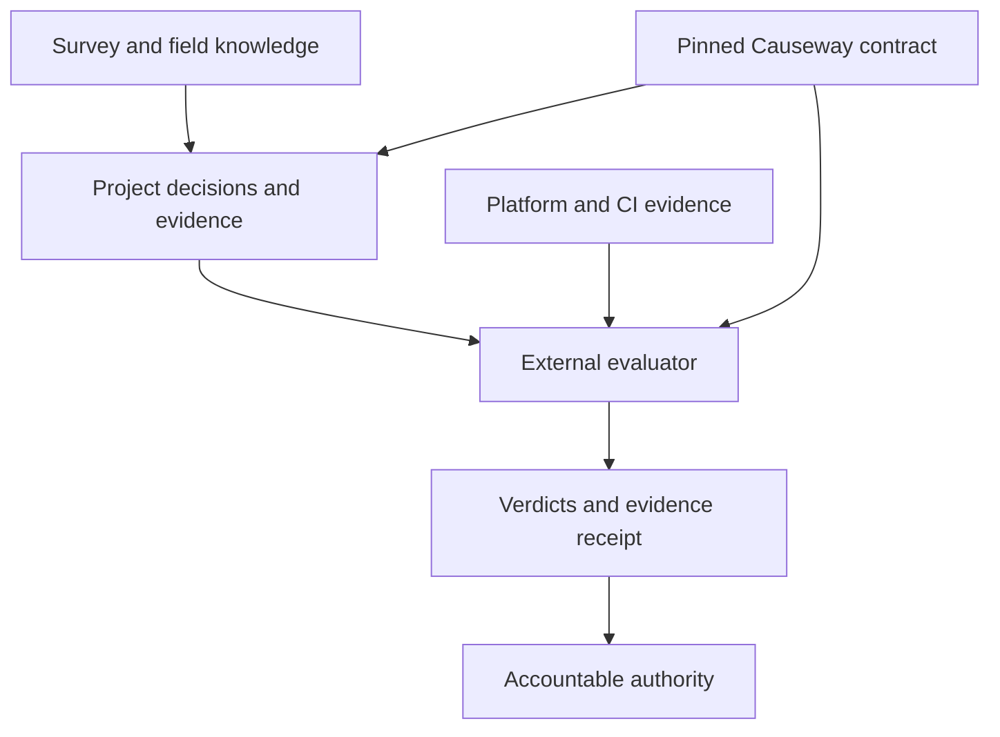

# Causeway

**Engineering discipline that travels with your code.**

Causeway gives software projects a repeatable way to discover constraints, record important decisions, guide human and AI contributors, and specify the evidence required for delivery. It packages that discipline as versioned files you install in your repository: engineering rules, decision templates, intake methods, and a machine-readable gate contract.

It is for teams—and individual AI-assisted builders—who can produce working software but need a reliable way to explain **why it was built this way, what has been checked, what remains unresolved, and who owns the consequences.**

The practical value is continuity. The next developer, coding agent, reviewer, or maintainer inherits the project's constraints and reasoning from its files. Important knowledge survives a new chat, a staff change, and the next release.

**Current boundary:** Causeway supplies the standard, installation tools, adoption diagnostics, and evaluator conformance fixtures. A separate evaluator executes the product checks. People retain design, risk-acceptance, and release authority. Installing Causeway does not certify a system or establish production readiness.

## A concrete example

You ask a coding agent to add AI summarization to a case-management application. It can write the API call immediately. The harder question is whether those case records are allowed to leave the system.

An illustrative Causeway workflow makes that question visible before it becomes an implementation default:

| What the team knows | What happens next |
|---|---|
| The customer has not confirmed which fields may leave the boundary | The Survey records an owned open question and marks dependent decisions `BLOCKED` |
| Two redaction approaches are plausible, but neither has been measured | The decision becomes a `PROBE` with a bounded experiment |
| Alternatives, deciding constraints, supporting evidence, and upstream decisions are available | The decision becomes `READY` for an architectural decision record (ADR) |
| The ADR closes inference-boundary decision `SA-5.16` | It must name the individual who approves it |
| Delivery is evaluated | The evaluator checks the applicable obligations and reports the evidence and gaps |

The last obligation has a real [conformance fixture](https://github.com/deiotte/causeway/tree/main/conformance/fixtures/missing-named-approver). It records `Data Owner` as a role but omits the person's name. For its Mission-tier, C2 system, the profile is G2 and the [expected result](https://github.com/deiotte/causeway/blob/main/conformance/expectations.json) includes:

```json
{
  "exit_code": 1,
  "checks": { "named-approvers": "fail" },
  "evidence": {
    "named-approvers": { "missing_rows": ["SA-5.16"] }
  }
}
```

This is an excerpt from the fixture expectation, not output from an evaluator run. A name in an ADR establishes a required record; it does not authenticate the person's approval or prove the redaction works. Those remain separate responsibilities.

## How the pieces work together

1. **Find the ground truth.** The Survey captures purpose, constraints, workload, invariants, failure responses, assumptions, and dependencies. Practitioners can contribute field notes in their own language.
2. **Decide what the project owes.** Placement establishes the system's tier and criticality. The Decision Spine identifies the architecture decisions in scope.
3. **Record the reasoning.** ADRs preserve the alternatives, deciding forces, accepted answer, approvers, and any dated waivers. Open items stay visible in a separate index.
4. **Build under persistent instructions.** Build DNA and topic rules guide humans and coding agents. Project-specific constraints and exceptions live alongside the standard.
5. **Evaluate against an identified contract.** An external engine reads the pinned check definitions, profile, and available product evidence. It returns verdicts and an evidence receipt for the accountable authority.



The connection between these records is the useful part: a constraint informs a decision; the decision identifies an obligation; the gate defines the evidence needed to inspect it. A collection of generic prompts does not preserve that chain by itself.

## What ships

| Part | What you get |
|---|---|
| [Survey](https://github.com/deiotte/causeway/blob/main/skills/survey/SKILL.md) | Structured intake and decision readiness: `READY`, `BLOCKED`, `PROBE`, or `NOT-A-DECISION` |
| [Decision Spine](https://github.com/deiotte/causeway/blob/main/skills/decision-spine/reference/spine.md) | 94 architecture decision rows, including 28 one-way decisions; scope depends on criticality |
| [Build DNA](https://github.com/deiotte/causeway/blob/main/AGENTS.md) | Engineering defaults, ownership, exceptions, ADR discipline, and expectations for AI-assisted work |
| [Gate contract](https://github.com/deiotte/causeway/blob/main/gate/gate-configuration.md) | 27 check definitions, 14 input classes, four profiles, eight verdicts, and the receipt contract |
| [Field-note method](https://github.com/deiotte/causeway/blob/main/skills/field-note/SKILL.md) | An entry point for people who know the work but do not write software, with a maintainer obligation to answer |
| [ServiceNow overlay](https://github.com/deiotte/causeway/blob/main/overlays/servicenow.md) | A responsibility and evidence map for applications built on the platform |
| [Distribution tools](https://github.com/deiotte/causeway/tree/main/tools) | Installation, pinning, drift detection, release verification, adoption diagnosis, and starter upgrades |

Build DNA has opinions, including service-oriented decomposition and dependency choices. Deviations are supported through explicit, owned decisions. Organizational managed policy takes precedence; Causeway does not supply that organizational policy.

## Current source and published releases

Review snapshot: **2026-10-08**, commit [`b9f1de9`](https://github.com/deiotte/causeway/commit/b9f1de986c51baecf4accf8e9f1e74e9e7ca5d99).

| Artifact | State at review |
|---|---|
| Source version | 2.10.0; `RELEASED` contains 2026-10-09 |
| Build DNA / Decision Spine / gate configuration | 1.14 / 0.8 / 0.8 |
| ServiceNow overlay | 1.12 |
| Published GitHub release | [v2.2.0](https://github.com/deiotte/causeway/releases/tag/v2.2.0), published 2026-10-02; the only published release returned at review |

The source version and `RELEASED` file are not proof that an archive has been published. The newer capabilities below are present in the reviewed source; they are not present in the older v2.2.0 release. Check the [release page](https://github.com/deiotte/causeway/releases) before selecting an installation artifact.

The current 34-file consumer bundle has digest:

```text
sha256:d48de8a1f34395fa58300da1f74cd1a8ea72aaefb15c2c29fd7e6516047a0b31
```

That identifies the contract-file set in `bundle/manifest.json`, not every file in the repository or installation archive.

## Try the distribution path

### Explore the reviewed source on Linux

This disposable example demonstrates today's installation and adoption tools. It deliberately installs a development snapshot without `--require-release`; it is not a production release pin.

Use Bash, Git, Python 3, and ordinary GNU command-line utilities. OpenSSH with signing support is needed for signature verification; GNU `diff3` is needed for starter upgrades.

```bash
git clone https://github.com/deiotte/causeway.git
cd causeway
git checkout --detach b9f1de986c51baecf4accf8e9f1e74e9e7ca5d99

python3 tools/validate.py
bash tools/build-bundle.sh --check

CAUSEWAY_SOURCE="$PWD"
CAUSEWAY_PROJECT="$(mktemp -d)"
bash "$CAUSEWAY_SOURCE/tools/sync.sh" "$CAUSEWAY_PROJECT"

(
  cd "$CAUSEWAY_PROJECT"
  bash tools/check-drift.sh
  bash tools/doctor.sh --json
)
```

The review reproduced a clean drift result: **28 of 30 bundle files** verified, with the two optional ServiceNow files absent. The doctor's JSON included these states:

```json
{
  "installed": true,
  "integrity": "verified",
  "adoption": "incomplete",
  "evaluated": "not-determined-by-doctor"
}
```

This is the expected starting point. The standard is present and consistent, while placement, project details, reviewers, CI configuration, and evaluator selection still need attention. The development pin is also reported as incomplete. Repository settings remain unverified offline.

`doctor.sh` is advisory: findings do not make it exit nonzero. A zero exit code is not an adoption pass or a gate verdict. Python 3 enables its structured placement checks; without Python, that portion is reported unverified. Since 2.7.0 it names the placement state — `declared`, `asserted` (a class nobody is recorded as declaring) or `defaulted` (no class, so the gate runs C1) — looks for the ADRs closing SA-1.1 and SA-1.14, and reads `system.json`'s git history for a lowering made without a new declaration ([ADR 0047](decisions/0047-tell-a-declared-placement-from-a-defaulted-one.md)). A name in the declaration is a recorded assertion, not an authentication of approval.

To see the drift check catch a change, use only the disposable directory above:

```bash
printf '\n# review-only local edit\n' >> "$CAUSEWAY_PROJECT/gate/profiles.json"
(
  cd "$CAUSEWAY_PROJECT"
  bash tools/check-drift.sh
)
```

Expected and locally reproduced: `DRIFTED  gate/profiles.json`, exit **5**. Re-syncing restores governed content.

### Install a published release for real use

Obtain an actual published archive and its SHA-256 sidecar from [Releases](https://github.com/deiotte/causeway/releases). Verify the checksum, extract it, and run its `tools/sync.sh` against the project with `--require-release`. Run both `tools/check-drift.sh` and `tools/verify-release.sh` in the installed project.

Acquisition needs access to the release source. Installation from an extracted, signed archive can run offline without Git or GitHub credentials. The release statement and signature travel inside the archive.

`--require-release` accepts either a clean checkout at an exact tag or a verified signed statement, with content matching the manifest. The lock distinguishes `git-tag` from `signed-statement`. A local tag does not authenticate the publisher. For that assurance, verify the signed statement using a trust anchor established independently.

## Installation, adoption, and upgrades

The current tools distinguish four questions: **Is it installed? Is its content intact? Is setup complete? Has the product been evaluated?**

| Tool | Responsibility and boundary |
|---|---|
| `sync.sh` | Plans and stages installation before applying it; records the pin after the other writes. Covered refusals and handled apply failures preserve or restore the target. It does not complete project adoption. |
| `check-drift.sh` | Recomputes the manifest identity and checks installed governed content. It does not query GitHub for newer releases or evaluate the product. |
| `verify-release.sh` | Verifies the signed statement and compares declared identity values. It does not hash every installed file; run the drift checker too. |
| `doctor.sh` | Reports missing setup with remedies. It cannot prove branch protection, authenticate approvals, or execute the gate. |
| `upgrade-starters.sh` | Compares original template, project edits, and new template; offers upgrades for project-owned starter files. Run it from the new source or release directory. |

Installation preserves an existing project-owned `AGENTS.md` by refusing to replace it. Gemini, Copilot, and Cursor instruction files keep project text outside Causeway's managed section. Existing `CLAUDE.md` is preserved, with a warning if it lacks the expected import. See [adoption instructions](https://github.com/deiotte/causeway/blob/main/ADOPTING.md) for integrating existing instructions.

The nine project-owned starters are seeded once. Since 2.6.0, installation also records their original templates under `.causeway/`; commit that directory with the project. To preview later template changes:

```bash
bash "$CAUSEWAY_SOURCE/tools/upgrade-starters.sh" "$CAUSEWAY_PROJECT"
```

Report mode writes proposals outside the project. After review, `--apply` takes clean replacements, clean three-way merges, and identical-template baseline adoption. Conflicts and older customized files without a baseline require manual review; `--accept <file>` records the new baseline after that work. The upgrader is not a whole-project transactional migration tool.

Actual adoption also requires declaring placement, filling project constraints and reviewers, recording decisions and exceptions, choosing an evaluator or explicitly recording its absence, providing evidence, and configuring merge enforcement. See [ADOPTING.md](https://github.com/deiotte/causeway/blob/main/ADOPTING.md).

## How rigor is determined

Tier describes the system's architectural role; criticality describes the consequences of failure. The gate profile is derived from both, never chosen independently:

| Tier | C3 | C2 | C1 |
|---|---|---|---|
| Operational | G0 | G1 | G1 |
| Mission | G1 | G2 | G2 |
| Core | G2 | G3 | G3 |

The Decision Spine scopes 23 rows to C3, 89 to C2, and all 94 to C1. Missing criticality defaults to C1; missing tier prevents profile resolution. An authorized declaration is still required—an inferred default is not a person's decision.

The profile determines which check failures block, warn, or are skipped. Some obligations block at every profile. Required checks that cannot run must report `unsupported` or `error`, not success. `tests-with-source` remains advisory at every profile; its proposed promotion is not active.

## ServiceNow: inherited platform, explicit application responsibilities

The optional overlay classifies the Spine's decisions as **11 inherited, 39 shared, and 44 project-answered**. An inherited answer still needs its applicable inheritance recorded. The overlay also maps checks and input classes to platform evidence.

**17 of the 27 checks read at least one product-repository input class.** An update-set-only delivery path cannot supply all of those inputs. Copying Causeway onto a machine does not produce missing source, history, approvals, or test evidence.

To include the overlay, add `--overlay servicenow` when running `sync.sh`. It adds the two overlay files, allowing the drift checker to verify all 30 bundle members.

This repository provides no ServiceNow connector, ATF runner, Instance Scan collector, or complete platform evidence-to-receipt loop. The overlay is a specification and responsibility map; its JSON projection does not add a gate input or relax the core checks.

## Evidence and present limits

The review ran the following against the source commit above:

| Evidence | Observed result | What it establishes |
|---|---|---|
| `tools/validate.py` | Completes 756 internal consistency checks | Agreement among the standard's artifacts, counts, references, and guarded rules |
| Bundle and adapter checks | Passed | Manifest reproduction and references to the three shipped skills |
| `test-sync.sh` | 32 passed, 0 failed | Covered refusals, rollback, content checks, and preservation of agent instructions |
| `test-doctor.sh` | 26 passed, 0 failed | Covered setup findings and read-only behavior |
| `test-upgrade-starters.sh` | 28 passed, 0 failed | Covered baseline, merge, conflict, and older-project upgrade cases |
| `test-release-archive.sh --throwaway` | 13 passed, 0 failed | Synthetic signed archive installation without Git, plus tampering and missing-verifier refusal |
| `test-publish-release.sh` | 12 passed, 0 failed | Publication preconditions and failure behavior against a stub GitHub CLI |
| Consumer demonstration | Clean install, incomplete adoption, then detected drift | The observable installation-to-diagnostic path described above |

The [upstream workflow](https://github.com/deiotte/causeway/actions/runs/37826046496) also succeeded at this commit. The active [main ruleset](https://github.com/deiotte/causeway/rules/24343008) requires a pull request and `The standard holds`, with no listed bypass actors. It does not require an approving reviewer or code-owner review. These settings were inspected; an intentionally failing merge attempt was not performed.

Keep the assurance boundaries explicit:

- **Standard validation is not product validation.** No external evaluator was executed in this review. The conformance pack contains **9 fixtures over 5 checks**; it does not establish all-check engine compatibility.
- **Adoption diagnosis is not enforcement.** Survey readiness, decision quality, field-note disposition, and whether an agent follows its instructions are not established by a clean install or doctor output.
- **The distribution tests are bounded.** Throwaway signing keys test the mechanism, not production key custody. A stub `gh` tests orchestration, not a live publication. Handled rollback tests do not establish crash-atomic installation; interrupted writes or failed recovery remain a boundary.
- **Independent outcomes are unmeasured.** The repository does not establish reduced defects, faster delivery, lower accreditation effort, or successful adoption by an independent team. Those are goals for a measured trial.

## Integrity and trust

The lock records what was installed. The manifest digest identifies the selected contract files. An SSH-signed release statement attests the declared release identity and bundle digest under the `causeway-release` namespace.

The trust anchor travels with the content, so consumers must establish trust in that key independently when the delivery channel is untrusted. Replacing the package, key, and signature together can produce a self-consistent package from a different signer.

The signed bundle does not cover the entire installer archive: `sync.sh`, adapter files, and several starter templates sit outside that contract digest. An unsigned checksum sidecar does not independently authenticate that larger surface. The release key is held within the repository's Actions administrative boundary; key lifecycle and compromise recovery remain open work.

Receipt storage, access controls, retention, signing, and replay infrastructure belong to the evaluator or surrounding system. Causeway defines the evidence contract and does not provide that infrastructure. Report vulnerabilities through [SECURITY.md](https://github.com/deiotte/causeway/blob/main/SECURITY.md).

## Repository map

| Path | Purpose |
|---|---|
| `AGENTS.md` | Build DNA and role obligations |
| `ADOPTING.md` | Installation-to-adoption workflow and trial measures |
| `skills/` | Survey, Decision Spine, and field-note methods |
| `rules/` | Topic-specific engineering guidance |
| `gate/` | Check definitions, profiles, inputs, and receipt contract |
| `overlays/` | Platform responsibility and evidence mappings |
| `templates/` | Project starters, ADRs, Survey, waivers, and field notes |
| `adapters/` | Coding-tool instruction pointers |
| `bundle/` | Manifest, scope declaration, and release trust anchor |
| `conformance/` | External-engine fixtures and expected outcomes |
| `decisions/` | Causeway's own ADRs and open-items index |
| `tools/` | Distribution, diagnostics, upgrades, validation, and tests |
| `.github/workflows/` | Source checks and release publication workflow |

## Development priorities

The standard's own index tracks **31 open items across four registers**. That index records declared gaps; it does not prove their closure in consuming projects.

1. **Publish and verify the newer release path.** Bring available release artifacts and installation instructions into agreement with the source, then verify the downloaded consumer experience. [#1](https://github.com/deiotte/causeway/issues/1), [#3](https://github.com/deiotte/causeway/issues/3).
2. **Establish evaluator compatibility.** Publish a version/check/input coverage matrix and expand conformance around consequential failure boundaries. [#6](https://github.com/deiotte/causeway/issues/6).
3. **Run a measured outside-adopter trial.** Follow one project from intake through retained evaluator receipt and later changes. Measure setup effort, maintainer workload, false positives, and decision churn. [#18](https://github.com/deiotte/causeway/issues/18).
4. **Complete operational trust and enforcement evidence.** Define signing-key lifecycle and installer attestation; demonstrate failed-check merge blocking and monitor protection drift. [#4](https://github.com/deiotte/causeway/issues/4), [#2](https://github.com/deiotte/causeway/issues/2).
5. **Close the ongoing feedback loop.** Track field-note answers, revisit decisions when constraints change, and clarify managed policy and placement changes. [#14–17](https://github.com/deiotte/causeway/issues).

## Contributing and license

Issues and field experience are welcome. External pull requests are not currently accepted; see [CONTRIBUTING.md](https://github.com/deiotte/causeway/blob/main/CONTRIBUTING.md). Causeway has one maintainer and no named successor; [GOVERNANCE.md](https://github.com/deiotte/causeway/blob/main/GOVERNANCE.md) records authority and continuity.

Licensed under [Apache-2.0](https://github.com/deiotte/causeway/blob/main/LICENSE), with attribution in [NOTICE](https://github.com/deiotte/causeway/blob/main/NOTICE). Vendored copies carry both under `bundle/`.
